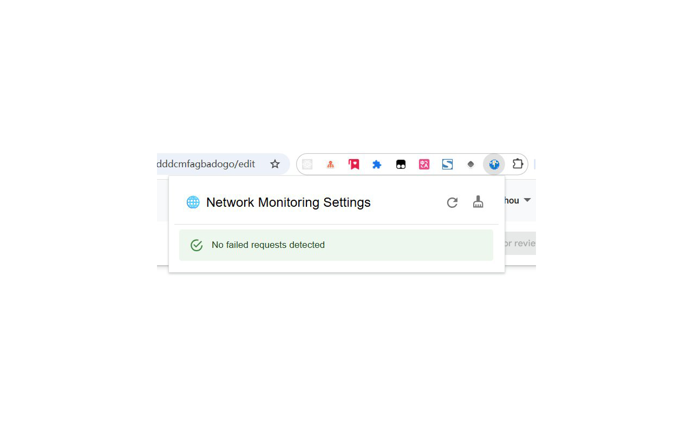
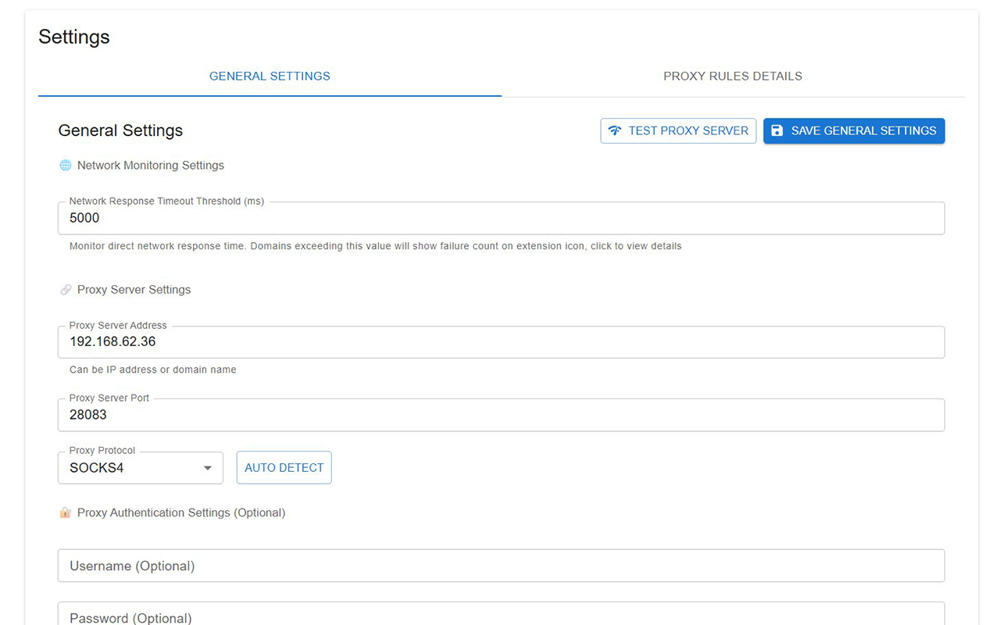
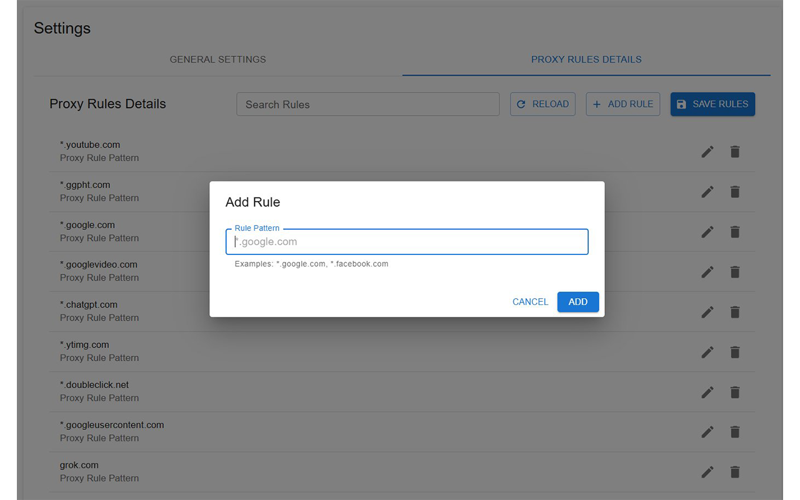
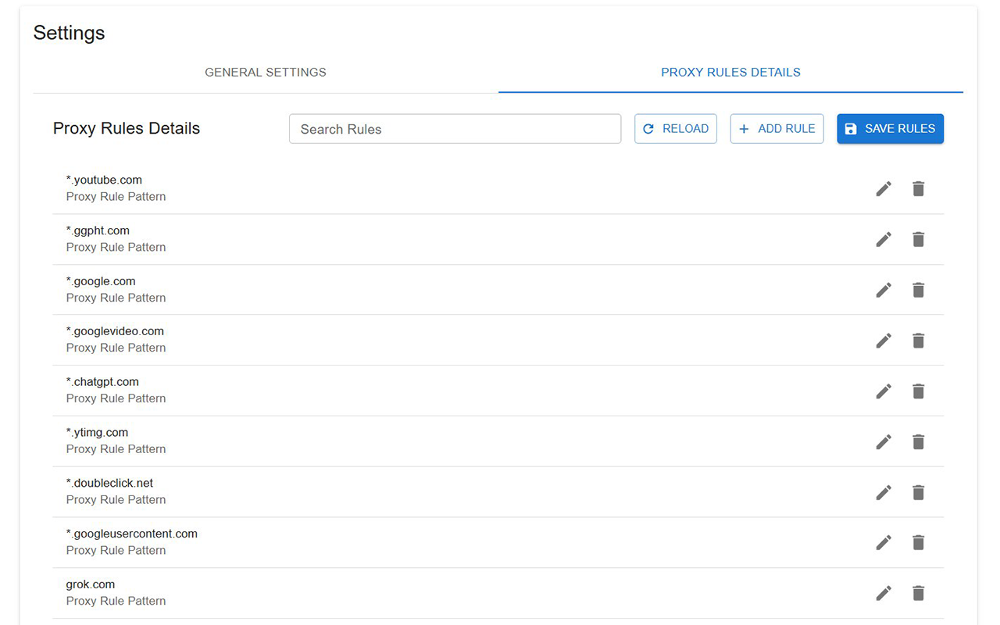
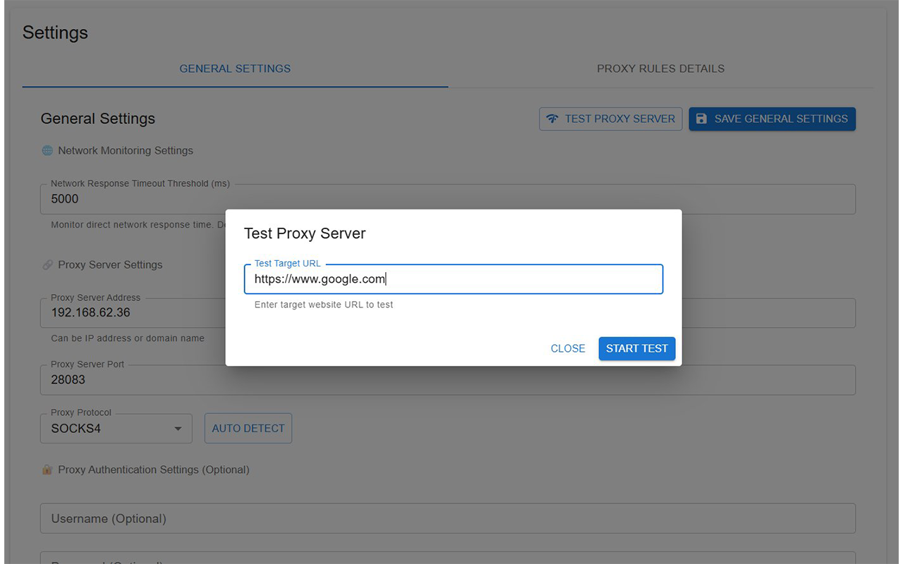
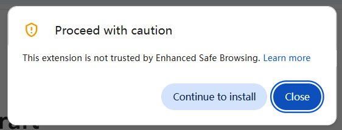

# Proxy Switch Craft

[](https://chromewebstore.google.com/detail/proxy-switch-craft/geaaeblhngmdakfhfgdddcmfagbadogo)

**Languages:** [English](README.md) | [中文](README.zh.md)

A simple and easy-to-use Chrome browser proxy management extension, designed to replace SwitchyOmega for proxy settings management and switching.

## Screenshots

### Extension Popup Interface


_Extension popup showing failed requests monitoring and quick proxy actions_

### General Settings Page


_Proxy server configuration interface with protocol selection and connection testing_

### Add Proxy Rules


_Interface for adding and managing domain-based proxy rules_

### Proxy Rules Management


_View and manage existing proxy rules with domain patterns_

### Proxy Server Testing


_Proxy server connectivity testing with response time and status indicators_

## Extension Overview

**Proxy Switch Craft** is a powerful proxy management Chrome extension designed for users who need convenient proxy settings management. Since SwitchyOmega has stopped updating, this extension provides a modern alternative with the following features:

### 🚀 Main Features

-   **Smart Proxy Switching** - Automatically choose proxy or direct connection based on domain rules
-   **Network Monitoring** - Real-time monitoring of network request performance, automatically identifying websites that need proxy
-   **Batch Operations** - Support for batch adding failed domains to proxy rules
-   **Multi-Protocol Support** - Support for HTTP, HTTPS, SOCKS4, SOCKS5 proxy protocols
-   **Auto Detection** - Intelligent detection of proxy server protocol types
-   **Bilingual Interface** - Support for both Chinese and English interfaces
-   **Real-time Notifications** - Display failed request count through extension icon badge

### 🎯 Core Advantages

-   **Lightweight & Efficient** - Built on modern web technologies with excellent performance
-   **User-Friendly** - Intuitive Material Design interface
-   **Intelligent** - Automatic monitoring and suggestions for websites needing proxy
-   **Professional-Grade** - Support for PAC script auto-configuration

## Installation Methods

### Method 1: Chrome Web Store Installation (Recommended)

1. Visit Chrome Web Store and search for "Proxy Switch Craft"
2. Click the "Add to Chrome" button
3. Click "Add Extension" in the confirmation dialog
4. After installation, the extension icon will appear in the browser toolbar

### Method 2: Developer Mode Installation

1. Download and extract the plugin files
2. Open the Chrome extensions page (`chrome://extensions/`)
3. Enable "Developer mode" in the top right corner
4. Click "Load unpacked"
5. Select the extracted plugin folder
6. Confirm installation completion

### Method 3: Build from Source

```bash
# Clone repository
git clone https://github.com/your-username/proxy-switch-craft.git
cd proxy-switch-craft

# Install dependencies
pnpm install

# Build production version
pnpm build

# Built files are in the build/chrome-mv3-prod directory
```

## Usage Instructions

### Basic Configuration

1. **Open Settings Page**

    - Right-click the extension icon and select "Options"
    - Or click "Details" on the Chrome extensions management page

2. **Configure Proxy Server**

    - Configure proxy server in the "General Settings" tab
    - Fill in proxy server address (IP or domain name)
    - Set proxy server port
    - Choose proxy protocol (HTTP/HTTPS/SOCKS4/SOCKS5)
    - Configure authentication information if needed

3. **Network Monitoring Settings**
    - Set response time threshold (default 5000ms)
    - Requests exceeding the threshold will be marked as failed
    - Extension icon will display failed request count

### Proxy Rules Management

1. **Add Proxy Rules**

    - Switch to "Proxy Rules Details" tab
    - Click "Add Rule" button
    - Enter domain pattern (e.g., `*.google.com`)
    - Save rule

2. **Rule Format Description**

    - `*.google.com` - Matches google.com and all its subdomains
    - `google.com` - Only matches google.com

3. **Batch Add Rules**
    - Click extension icon to view failed request list
    - Use "Add All to Proxy" feature for batch adding rules
    - Or add specific domains individually

### Real-time Monitoring

1. **View Failed Requests**

    - Click extension icon to open popup
    - View list of timed-out or failed requests
    - Real-time display of request time and error information

2. **Quick Operations**
    - Click "+" button after individual domain name to add to proxy rules
    - Use "Add All to Proxy" for batch processing
    - Use "Clear List" to reset monitoring

### Proxy Testing

1. **Test Proxy Connectivity**

    - Click "Test Proxy Server" on settings page
    - Customize test target URL
    - View connection status and response time

2. **Auto Protocol Detection**
    - After configuring server address and port
    - Click "Auto Detect" button
    - System will automatically identify the best protocol type

## ⚠️ Chrome Installation Warning

When installing this extension, Chrome may display a warning due to its proxy management features:


_Chrome installation warning for proxy-related extensions_

**Why this happens:**  
Chrome shows this warning for extensions that request sensitive permissions (such as proxy/network control). This is a standard security measure and does not mean the extension is unsafe.

**What you should do:**  
If you installed from the official Chrome Web Store link above, you can safely proceed with the installation. The extension does not collect or upload any user data.

## Important Notes

### Usage Guidelines

1. **Permission Requirements**

    - This plugin requires network access permissions to monitor requests
    - Requires proxy setting permissions to manage browser proxy
    - Does not collect or upload any user data

2. **Performance Impact**
    - Plugin uses efficient request monitoring mechanisms
    - Minimal impact on browser performance
    - Only monitors failed requests, does not affect normal browsing

### Troubleshooting

1. **Proxy Connection Issues**

    - Check if proxy server address and port are correct
    - Confirm proxy server is running normally
    - Check network connection and firewall settings

2. **Rules Not Taking Effect**
    - Confirm proxy rules have been saved
    - Refresh target webpage to reload
    - Check if domain rule format is correct

### Privacy Protection

-   All settings data is stored locally in the browser only
-   Does not upload or share any user data
-   Complies with Chrome extension privacy policies
-   Open source code, transparent and trustworthy

### Technical Support

For problems or help:

-   Check GitHub Issues page
-   Send email to: biscuit_zhou#outlook.com (replace # with @)
-   Leave feedback on Chrome Web Store page
