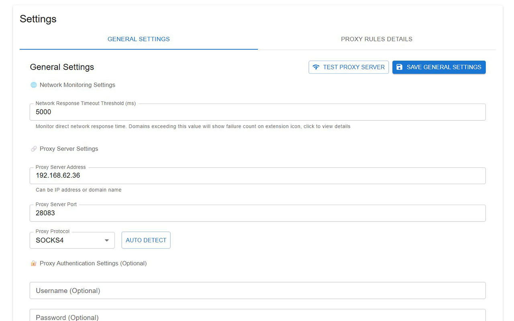
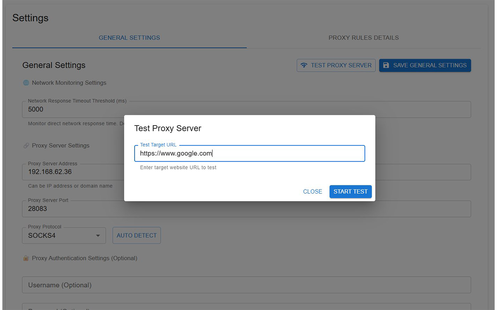

# Proxy Switch Craft

**语言:** [English](README.md) | [中文](README.zh.md)

一个简单易用的Chrome浏览器代理管理扩展，用于替代SwitchyOmega进行代理设置管理和切换。

## 界面截图

### 扩展弹窗界面


_扩展弹窗显示失败请求监控和快速代理操作_

### 常规设置页面


_代理服务器配置界面，包含协议选择和连接测试功能_

### 添加代理规则


_添加和管理基于域名的代理规则界面_

### 代理规则管理


_查看和管理现有代理规则及域名模式_

### 代理服务器测试


_代理服务器连通性测试，显示响应时间和状态指示_

## 插件简介

**Proxy Switch Craft** 是一个功能强大的代理管理Chrome扩展，专为需要便捷管理代理设置的用户设计。由于SwitchyOmega已停止更新，本插件提供了现代化的替代方案，具有以下特点：

### 🚀 主要功能

-   **智能代理切换** - 基于域名规则自动选择代理或直连
-   **网络监控** - 实时监控网络请求性能，自动识别需要代理的网站
-   **批量操作** - 支持批量添加失败域名到代理规则
-   **多协议支持** - 支持HTTP、HTTPS、SOCKS4、SOCKS5代理协议
-   **自动检测** - 智能检测代理服务器协议类型
-   **双语界面** - 支持中文和英文界面
-   **实时通知** - 通过扩展图标显示失败请求数量

### 🎯 核心优势

-   **轻量高效** - 基于现代Web技术构建，性能优异
-   **用户友好** - 直观的Material Design界面
-   **智能化** - 自动监控和建议需要代理的网站
-   **专业级** - 支持PAC脚本自动配置

## 安装方法

### 方法一：Chrome Web Store安装（推荐）

1. 访问Chrome Web Store搜索"Proxy Switch Craft"
2. 点击"添加至Chrome"按钮
3. 在弹出的确认对话框中点击"添加扩展程序"
4. 安装完成后，浏览器工具栏会显示扩展图标

### 方法二：开发者模式安装

1. 下载并解压插件文件
2. 在Chrome浏览器中打开扩展程序页面（`chrome://extensions/`）
3. 开启右上角的"开发者模式"
4. 点击"加载已解压的扩展程序"
5. 选择解压后的插件文件夹
6. 确认安装完成

### 方法三：从源码构建

```bash
# 克隆仓库
git clone https://github.com/your-username/proxy-switch-craft.git
cd proxy-switch-craft

# 安装依赖
pnpm install

# 构建生产版本
pnpm build

# 构建后的文件在build/chrome-mv3-prod目录
```

## 使用方法

### 基础配置

1. **打开设置页面**
    - 右键点击扩展图标，选择"选项"
    - 或者在Chrome扩展管理页面点击"详细信息"
2. **配置代理服务器**

    - 在"常规设置"标签页中配置代理服务器
    - 填写代理服务器地址（IP或域名）
    - 设置代理服务器端口
    - 选择代理协议（HTTP/HTTPS/SOCKS4/SOCKS5）
    - 如需要，可配置认证信息

3. **网络监控设置**
    - 设置响应时间阈值（默认5000ms）
    - 超过阈值的请求会被标记为失败
    - 扩展图标会显示失败请求数量

### 代理规则管理

1. **添加代理规则**

    - 切换到"代理规则明细"标签页
    - 点击"添加规则"按钮
    - 输入域名模式（如：`*.google.com`）
    - 保存规则

2. **规则格式说明**

    - `*.google.com` - 匹配google.com及其所有子域名
    - `google.com` - 仅匹配google.com

3. **批量添加规则**
    - 点击扩展图标查看失败请求列表
    - 使用"全部加入代理"功能批量添加规则
    - 或单独添加特定域名

### 实时监控

1. **查看失败请求**

    - 点击扩展图标打开弹窗
    - 查看响应超时或失败的请求列表
    - 实时显示请求时间和错误信息

2. **快速操作**
    - 点击单个域名后的"+"按钮添加到代理规则
    - 使用"全部加入代理"批量处理
    - 使用"清空列表"重置监控

### 代理测试

1. **测试代理连通性**
    - 在设置页面点击"测试代理服务器"
    - 可自定义测试目标URL
    - 查看连接状态和响应时间
2. **自动检测协议**
    - 配置服务器地址和端口后
    - 点击"自动检测"按钮
    - 系统会自动识别最佳协议类型

## 注意事项

### 使用须知

1. **权限要求**

    - 本插件需要网络访问权限以监控请求
    - 需要代理设置权限以管理浏览器代理
    - 不会收集或上传任何用户数据

2. **性能影响**
    - 插件采用高效的请求监控机制
    - 对浏览器性能影响极小
    - 仅监控失败请求，不影响正常浏览

### 故障排除

1. **代理无法连接**

    - 检查代理服务器地址和端口是否正确
    - 确认代理服务器是否正常运行
    - 检查网络连接和防火墙设置

2. **规则不生效**

    - 确认已保存代理规则
    - 刷新目标网页重新加载
    - 检查域名规则格式是否正确

### 隐私保护

-   所有设置数据仅存储在本地浏览器中
-   不会上传或共享任何用户数据
-   遵循Chrome扩展隐私政策
-   开源代码，透明可信

### 技术支持

如遇到问题或需要帮助：

-   查看GitHub Issues页面
-   发送邮件至：biscuit_zhou#outlook.com(请把#替换为@)
-   在Chrome Web Store页面留言反馈
